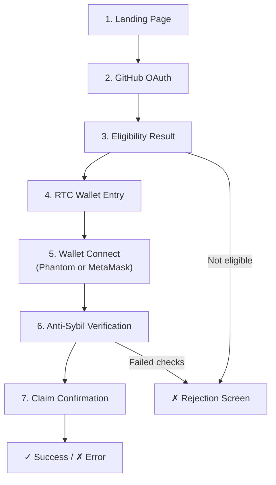

# RIP-305 Claim Page Specification

> Track D deliverable for [#1512](https://github.com/Scottcjn/rustchain-bounties/issues/1512).
> Parent: [#1149 — RIP-305 Cross-Chain Airdrop](https://github.com/Scottcjn/rustchain-bounties/issues/1149).

---

## 1. Claim Flow (7 Steps)



### Step 1 — Landing Page (`airdrop.rustchain.org`)
- Displays airdrop overview: 50,000 wRTC across Solana (30k) and Base (20k)
- "Connect GitHub" CTA button
- Live stats bar: total claimed / remaining / claims by chain

### Step 2 — GitHub OAuth
- Redirect to GitHub OAuth with scopes: `read:user`, `repo`
- Client ID configured via `AIRDROP_GITHUB_CLIENT_ID`
- On success: retrieve user identity, starred repos, merged PR count

### Step 3 — Eligibility Result
- Display qualifying tier and base claim amount

| Tier        | Requirement                      | Base Claim |
|-------------|----------------------------------|------------|
| Stargazer   | 10+ Scottcjn repos starred       | 25 wRTC    |
| Contributor | 1+ merged PR                     | 50 wRTC    |
| Builder     | 3+ merged PRs                    | 100 wRTC   |
| Security    | Verified vulnerability finding   | 150 wRTC   |
| Core        | 5+ merged PRs or Star King badge | 200 wRTC   |
| Miner       | Active attestation history       | 100 wRTC   |

- If ineligible: show which requirements are unmet and how to qualify

### Step 4 — RTC Wallet Entry
- User enters their RustChain wallet name (or generates a new one inline)
- Binds GitHub identity to on-chain wallet for anti-Sybil

### Step 5 — Wallet Connect
- **Solana**: Phantom browser extension or mobile deep-link → base58 pubkey
- **Base**: MetaMask with Base network (chainId `0x2105`) → EIP-55 address
- User selects target chain (Solana or Base)

### Step 6 — Anti-Sybil Verification

| Check                       | Blocks                          | Threshold        |
|-----------------------------|---------------------------------|------------------|
| Minimum wallet balance      | Empty wallet farms              | 0.1 SOL / 0.01 ETH |
| Wallet age ≥ 7 days         | Just-created wallets            | 7 days           |
| GitHub account age ≥ 30d    | Fresh bot accounts              | 30 days          |
| GitHub OAuth unique          | Multi-claim same account        | 1 per GitHub ID  |
| One claim per wallet         | Wallet recycling                | 1 per address    |
| No cross-chain double-claim | Double-dipping across chains    | 1 per GitHub ID  |
| RTC wallet binding           | Links on-chain identity         | Non-empty        |

- Wallet value multiplier applied:

| Solana Balance | Base Balance | Multiplier |
|---------------|-------------|------------|
| 0.1–1 SOL     | 0.01–0.1 ETH | 1.0x     |
| 1–10 SOL      | 0.1–1 ETH    | 1.5x     |
| 10+ SOL       | 1+ ETH       | 2.0x     |

### Step 7 — Claim Confirmation
- Display final wRTC amount (base × multiplier)
- User confirms → RTC locked on RustChain → wRTC minted to target wallet
- Show claim receipt: claim ID, transaction hash, bridge lock ID

---

## 2. Page States

| State             | Displays                                            |
|-------------------|-----------------------------------------------------|
| **Landing**       | Stats, CTA, airdrop description                    |
| **OAuth Pending** | Loading spinner during GitHub redirect               |
| **Eligible**      | Tier badge, base claim, "Continue" button            |
| **Ineligible**    | Missing requirements, how to qualify                |
| **Wallet Entry**  | RTC wallet input, "Generate" button                 |
| **Chain Select**  | Solana/Base toggle, wallet connect button            |
| **Verifying**     | Anti-Sybil check progress (7 check items)           |
| **Confirmed**     | Final amount, confirm button                         |
| **Success**       | Claim receipt, tx hash, share buttons               |
| **Error**         | Error message, retry option, blocking reasons       |

---

## 3. API Endpoints

| Method | Path                   | Description                       |
|--------|------------------------|-----------------------------------|
| GET    | `/airdrop/eligibility` | Check eligibility by GitHub user  |
| POST   | `/airdrop/claim`       | Execute the full claim pipeline   |
| GET    | `/airdrop/status`      | Aggregate airdrop statistics      |
| GET    | `/airdrop/leaderboard` | Top claimants by tier             |

See [API_CONTRACTS.md](API_CONTRACTS.md) for bridge endpoint schemas.

---

## 4. Dependencies on Other Tracks

| Track | Dependency                                         | Status      |
|-------|----------------------------------------------------|-------------|
| A     | Solana SPL wRTC token deployed + mint authority     | Required    |
| B     | Base ERC-20 wRTC deployed + mint/burn              | Required    |
| C     | `/bridge/lock` and `/bridge/release` endpoints      | Required    |

Track D uses a `StubBridgeClient` until Track C lands.  The bridge contract is defined in [API_CONTRACTS.md](API_CONTRACTS.md).

---

## 5. Error States & Edge Cases

| Scenario                          | Handling                                      |
|-----------------------------------|-----------------------------------------------|
| GitHub OAuth token expired         | Re-authenticate flow                          |
| Wallet balance drops mid-claim     | Anti-Sybil check uses balance at verification time |
| Bridge lock fails                  | Claim → EXPIRED, user can retry               |
| Duplicate claim attempt            | Rejected with "already claimed" message       |
| Airdrop pool exhausted             | Disabled CTA, "pool empty" banner             |
| Network RPC timeout                | Retry with exponential backoff, user notified |

---

## 6. Configuration

All thresholds are environment-configurable via `AIRDROP_*` prefix.  See `scripts/airdrop/config.py`.

Example `.env` for testnet:
```env
AIRDROP_RUSTCHAIN_NODE_URL=https://testnet.rustchain.org
AIRDROP_SOLANA_RPC_URL=https://api.devnet.solana.com
AIRDROP_BASE_RPC_URL=https://sepolia.base.org
AIRDROP_MIN_SOL_BALANCE=0.001
AIRDROP_MIN_ETH_BALANCE=0.001
AIRDROP_LOG_LEVEL=DEBUG
```
